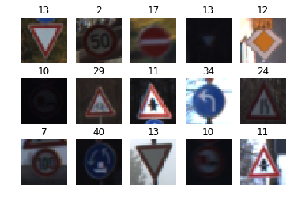
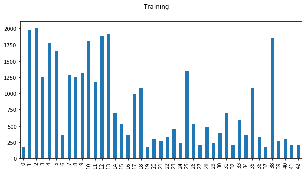
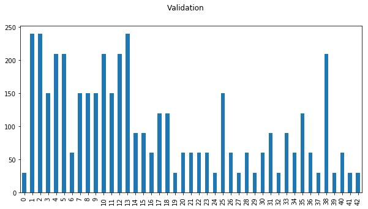
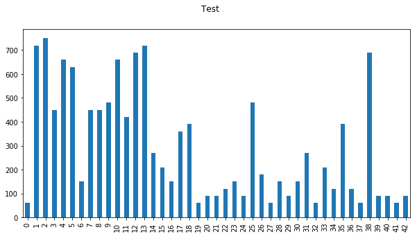
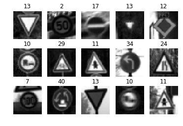
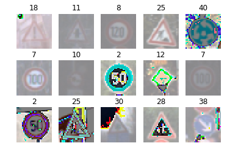
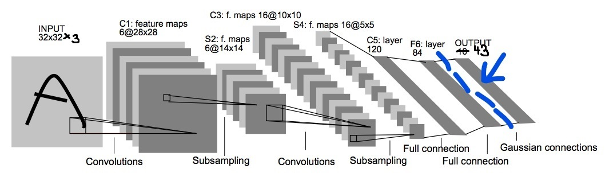
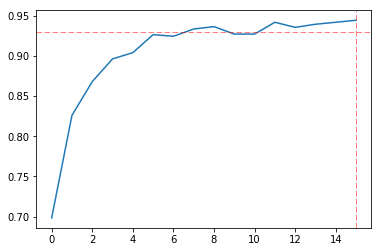
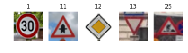

#**Traffic Sign Recognition** 

---

**Build a Traffic Sign Recognition Project**

The goals / steps of this project are the following:

* Load the data set (see below for links to the project data set)
* Explore, summarize and visualize the data set
* Design, train and test a model architecture
* Use the model to make predictions on new images
* Analyze the softmax probabilities of the new images
* Summarize the results with a written report

## Rubric Points

###Here I will consider the [rubric points](https://review.udacity.com/#!/rubrics/481/view) individually and describe how I addressed each point in my implementation.  

---

###Writeup / README

###Data Set Summary & Exploration

#### 1. Provide a basic summary of the data set. In the code, the analysis should be done using python, numpy and/or pandas methods rather than hardcoding results manually.

I used the pandas library to calculate summary statistics of the traffic
signs data set:

* The size of training set is 34799
* The size of the validation set 4410
* The size of test set is 12630
* The shape of a traffic sign image is 32 x 32 x 3
* The number of unique classes/labels in the data set is 43

#### 2. Include an exploratory visualization of the dataset.

Here is an exploratory visualization of the data set. The first image shows a matrix of randomly selected images with classes obtained from the provided description in ``signames.csv``. First, I've set up an infrastructure to show a table of ``m x n`` images and output basic information. The next image shows 15 (``m =  3, n = 5``) randomly selected images without pre-processing:

The next images depict the distribution of traffic sign classes in the respective data sets as bar charts.

###Design and Test a Model Architecture

#### 1. Describe how you preprocessed the image data. What techniques were chosen and why did you choose these techniques? Consider including images showing the output of each preprocessing technique. Pre-processing refers to techniques such as converting to grayscale, normalization, etc. (OPTIONAL: As described in the "Stand Out Suggestions" part of the rubric, if you generated additional data for training, describe why you decided to generate additional data, how you generated the data, and provide example images of the additional data. Then describe the characteristics of the augmented training set like number of images in the set, number of images for each class, etc.)

I have explored the behavior of the network after application of various pre-processing techniques. I started with conversion to grayscale, then applied different normalization algorithms. The conversion to grayscale seemed logical since the original LeNet architecture was designed for grayscale images and, intuitively, grayscale mages should contain enough information to classify the traffic sign type. This assumption turned out to be wrong – at least with the slightly modified LeNet network I ended up using. As a last step, I normalized the image data because this was a recommendation from the lectures and makes sense physically and mathematically.

Here is an example of the explorative data set after grayscaling: 

         
and after normalization (without grayscaling):

The function ``pre_process`` represents a unified gateway to pre-processing. It turned out during the experimentation that simple zero mean normalization yielded best results. Grayscale conversion made the training much faster (obviously, since the data set size was considerably reduced) but less stable - the convergence was slower, required more epochs and the training curve experienced unpredictable oscillations.

I did not generate additional data because after the tuning of the network architecture and the hyperparameters the network produced good results with existing data. 

####2. Describe what your final model architecture looks like including model type, layers, layer sizes, connectivity, etc.) Consider including a diagram and/or table describing the final model.

The architecture is a slightly modified LeNet from the lectures. The modifications consist of a dropout regularization added between the last hidden and the output layers. This helped to improve the condition of the optimizer a lot! The training converged faster with much less oscillations.

My final model consisted of the following layers:

| Layer | Description |
|:---:|:---:|
| Input, Convolution 1 | input 32x32x3, output 28x28x6 |
| RELU | |
| Max Pooling | input 28x28x6, output 14x14x6 |
| Convolution 2 | input 14x14x6, output 10x10x16 |
| RELU | |
| Max Pooling | input 10x10x16, output 5x5x16 |
| Flattening | input 5x5x16, output 400 |
| Fully connected 3 | input 400, output 120 |
| RELU | |
| Fully connected 4 | input 120, output 84 |
| RELU | |
| *Dropout* | |
| Fully Connected 5 | input 84, output 43 |

####3. Describe how you trained your model. The discussion can include the type of optimizer, the batch size, number of epochs and any hyperparameters such as learning rate.

To train the model, I used an iterative strategy:

1. Start with the initial LeNet archutecture. This includes the Adam optimizer which was confirmed a good choice by several other publications. I have not experimented with other optimizers.
2. Feed the raw (not pre-processed) data into the network and observe the training curve which is epochs vs. validation accuracy. 
3. Observe the convergence of the training process and modify the hyperparameters to improve it.
4. Modify pre-processing method and observe the convergence of the training process.
5. If neither hyper-parameter changes nor pre-processing yield desired results modify the network architecture. 

Performance of the training process was also an issue. After I've set up the local GPU environment, the iteration cycles became much faster (factor 10 compared to CPU only). The batch sizes had great influence on performance, especially after switching to GPU. I experimented with several values (always multiples of 2) but it turned out that ``BATCH_SIZE = 128`` was the best choice.

####4. Describe the approach taken for finding a solution and getting the validation set accuracy to be at least 0.93. Include in the discussion the results on the training, validation and test sets and where in the code these were calculated. Your approach may have been an iterative process, in which case, outline the steps you took to get to the final solution and why you chose those steps. Perhaps your solution involved an already well known implementation or architecture. In this case, discuss why you think the architecture is suitable for the current problem.

My final model results were:

* training set accuracy of 0.944
* test set accuracy of 0.927

If an iterative approach was chosen:

* **What was the first architecture that was tried and why was it chosen?**

I started with original LeNet architecture since it was the recommendation from the lectures and according to research in the internet the size of the network made sense for this category of tasks.

* **What were some problems with the initial architecture?**

It was my impression that the architecture is overfitting on the problem. I have had very long training phases with ``EPOCHS > 100`` with many oscillations until the optimizer reached the required precision. So my interpretation was that my network was learning some sort of noise instead of building up useful configuration. The low accuracy on test data confirmed this. 
 
* **How was the architecture adjusted and why was it adjusted? Typical adjustments could include choosing a different model architecture, adding or taking away layers (pooling, dropout, convolution, etc), using an activation function or changing the activation function. One common justification for adjusting an architecture would be due to overfitting or underfitting. A high accuracy on the training set but low accuracy on the validation set indicates over fitting; a low accuracy on both sets indicates under fitting.**

I started with adding dropout regularization on the output of the network. Then I repeated the process described in previous section and "voila" the convergence was almost perfect: after approx. 20 steps the network reaches > 94%/92% validation/test accuracy. Since this meets the requirements I haven't made further changes and went to the next steps. 

* **Which parameters were tuned? How were they adjusted and why?**

I tuned the `EPOCHS` hyperparameters using a simple heuristsics: When the last ``n`` validation accuracies are consistently above 94% stop the training. Using this approach I arrived at ``EPOCHS`` between 16 to 20 but it consistently remained below 20. My plan was to find a "optimization" strategy for ``BATCH_SIZE`` since it would significantly improve the training time, but I did not pursue this further. Finally the learning graphs (``EPOCHS`` vs ``accuracy``) for my network all resemble this shape:

* **What are some of the important design choices and why were they chosen? For example, why might a convolution layer work well with this problem? How might a dropout layer help with creating a successful model?**

The dropout definitely improved the condition of the optimizer yielding very smooth and quick learning curves. Convolutional models learn to generalize from details to more complex features. In my opiniono, this description matches the classification problem tackled here pretty well: The traffic signs consist of some basic featuyres which are hierarchically combined into bigger and more complex parts. 

###Test a Model on New Images

####1. Choose five German traffic signs found on the web and provide them in the report. For each image, discuss what quality or qualities might be difficult to classify.

Here are five German traffic signs that I found on the web:

The resulting images are all of different size, resolution and quality. I picked them randomly from the result of one Bing image query. I assumed that the differences in the "texture" of the images will be a factor when testing the robustness of my predictor.

####2. Discuss the model's predictions on these new traffic signs and compare the results to predicting on the test set. At a minimum, discuss what the predictions were, the accuracy on these new predictions, and compare the accuracy to the accuracy on the test set (OPTIONAL: Discuss the results in more detail as described in the "Stand Out Suggestions" part of the rubric).

Here are the results of the prediction:

| Image			        |     Prediction	        					| 
|:---------------------:|:---------------------------------------------:| 
| Speed limit (30km/h)  | Speed limit (30km/h)							| 
| Right-of-way at the next intersection | Right-of-way at the next intersection	|
| Priority road | Priority road |
| Yield					| Yield											|
| Road work	      		| Road work					 				    |
|:---------------------:|:---------------------------------------------:| 
| Image of Paul         | Yield |

The model was able to correctly guess 5 of the 5 traffic signs, which gives an accuracy of 100%. This compares favorably to the accuracy on the test set of 92.4%

####3. Describe how certain the model is when predicting on each of the five new images by looking at the softmax probabilities for each prediction. Provide the top 5 softmax probabilities for each image along with the sign type of each probability. (OPTIONAL: as described in the "Stand Out Suggestions" part of the rubric, visualizations can also be provided such as bar charts)

The code for making predictions on my final model is located in the 23th cell of the Ipython notebook.

For all images, the model is **very** sure about the class of the sign. The probabilty is always close to 1, with the next more probable class beeing close to zero. It actually looked suspicious to me so I started to mix the test set with other images which are obviously no tarffic signs, like "Image of Paul" and similar which in turn verified that the model was working correctly: The "Image of Paul" was classified as "Yield" (large portion of yellow and a shape ressemblance to human head?) but only with probability of 25%.

### (Optional) Visualizing the Neural Network (See Step 4 of the Ipython notebook for more details)
####1. Discuss the visual output of your trained network's feature maps. What characteristics did the neural network use to make classifications?

